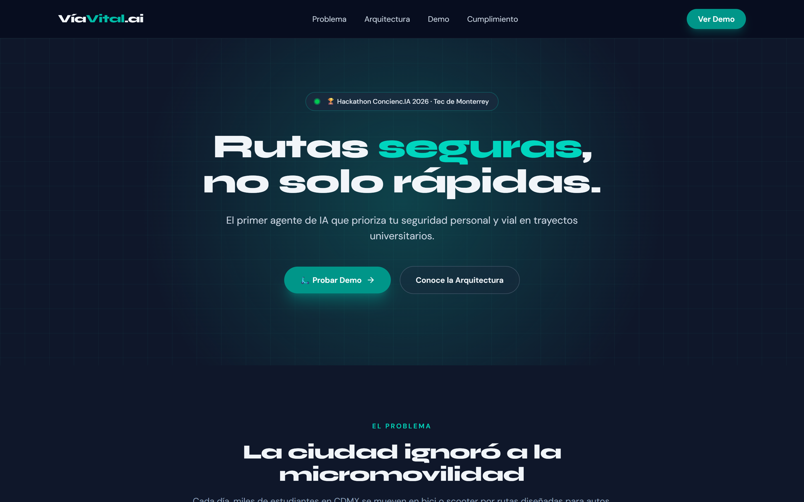
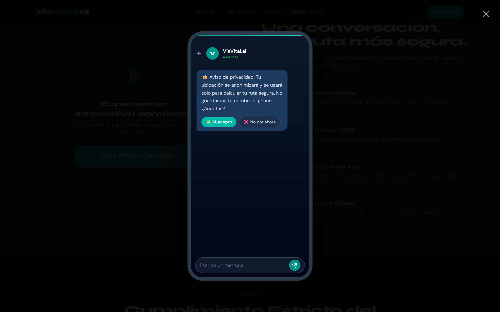
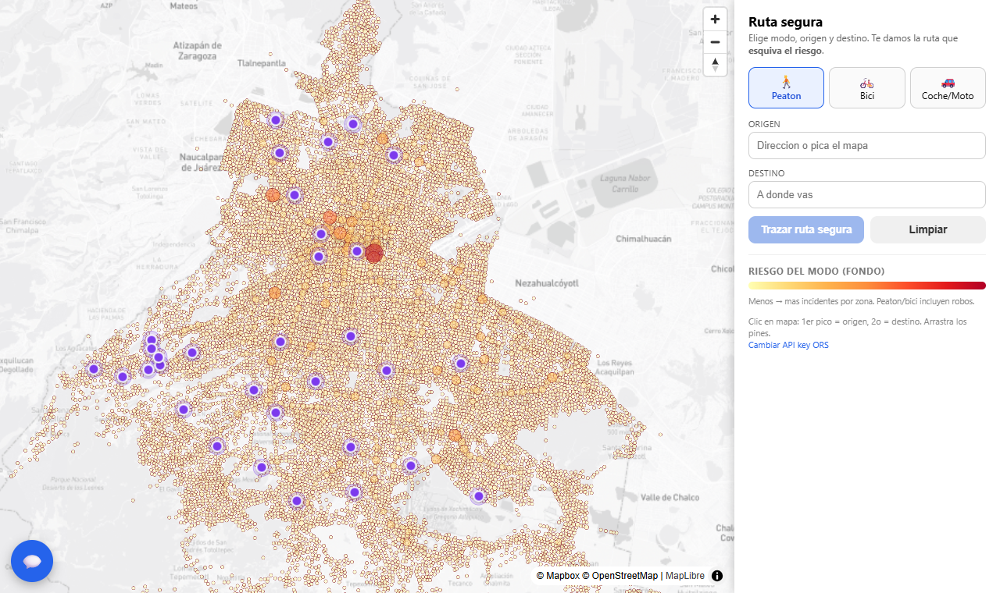
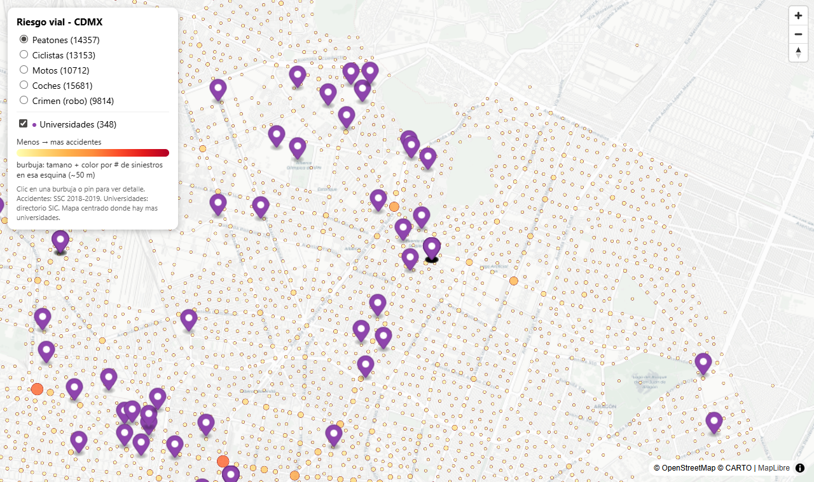

# ConciencIA — Micromovilidad Segura (CDMX)

> **Rutas seguras, no solo rápidas.** Un agente que analiza siniestros viales y
> robos en la Ciudad de México para trazar la ruta que **esquiva más incidentes**,
> por modo de viaje (peatón / bici / coche-moto).

Proyecto de hackathon (Conciencia 2026 · Tec de Monterrey). Datos abiertos del
Portal CDMX (CKAN) + FGJ. **Ningún número se inventa**: los scripts de Python leen
los datos crudos y producen las cifras, las burbujas de riesgo y los GeoJSON.

<p align="center">
  <a href="https://conciencia-micromovilidad.vercel.app"><b>🌐 Ver demo en vivo</b></a>
  &nbsp;·&nbsp;
  <a href="https://conciencia-micromovilidad.vercel.app/ruta_segurav2.html"><b>🛴 Abrir el motor de ruta segura</b></a>
  &nbsp;·&nbsp;
  <a href="https://conciencia-micromovilidad.vercel.app/mapa_riesgo.html"><b>🗺️ Mapa de riesgo</b></a>
</p>

---

## 📸 Cómo se ve

**Landing + propuesta**



**Demo en celular** — login → chat IA → mapa → ruta segura → rating



**Motor de ruta segura** — eliges modo, origen y destino; traza la más corta vs.
la **recomendada** (esquiva accidentes y robos) y mide el % de riesgo mitigado



**Mapa de riesgo** — burbujas por modo (peatón / ciclista / moto / coches / robo)
+ universidades de CDMX



---

## 🚀 Velo en vivo (sin instalar nada)

| Qué | Link |
|---|---|
| **Demo completa** (landing + app de celular) | <https://conciencia-micromovilidad.vercel.app> |
| ⭐ **Motor de ruta segura** (directo) | <https://conciencia-micromovilidad.vercel.app/ruta_segurav2.html> |
| **Mapa de riesgo** (directo) | <https://conciencia-micromovilidad.vercel.app/mapa_riesgo.html> |

> Los mapas son **autónomos**: traen sus llaves de demo embebidas, así que abren y
> funcionan para cualquiera, sin pedir nada. Abrir este repo en GitHub **no**
> ejecuta la página (GitHub solo muestra código) — usa los links de arriba.

---

## 📊 Datos (de dónde salen las cifras)

Todo viene del **Portal de Datos Abiertos de la CDMX** (CKAN,
`https://datos.cdmx.gob.mx`). El script `00_data_downloader.py` los baja vía la API
oficial — no se sube ni se modifica nada a mano.

| Fuente | Dataset (CKAN) | Periodo | Qué aporta |
|---|---|---|---|
| **C5 CDMX** | `incidentes-viales-c5` | ~11 años de volumen | Incidentes viales reportados al C5, clasificados por modo (peatón, bici, moto, coche) |
| **FGJ CDMX** | `carpetas-de-investigacion-fgj-de-la-ciudad-de-mexico` (acumulado) | 2016–2025 | Carpetas de investigación; se filtra **robo a transeúnte** (~148k) y se suma al riesgo de peatón y bici |
| **SSC / maestro** | derivado | — | Dataset maestro que une C5 + SSC, etiquetado por fuente y modo |
| Universidades | directorio CDMX | — | 348 planteles para marcar zonas universitarias en mapa/ruteo |

Volumen procesado (burbujas de riesgo generadas por el pipeline): **peatones
14 137 · ciclistas 13 153 · motos 10 772 · coches 15 881 · robo 9 814 ·
universidades 348**.

> ⚠️ **Las fuentes no se suman como totales:** cada fila va etiquetada por `fuente`
> (C5 ≠ SSC ≠ FGJ). Para el mapa/ruteo el robo se suma al riesgo del peatón/bici,
> pero en las cifras duras las fuentes quedan **separadas**. Encoding **UTF-8**
> (no latin-1; latin-1 corrompe acentos). Excepción: el directorio de
> universidades viene en latin-1.

---

## 🧠 Cómo funciona el motor de ruta segura

1. Pide a **OpenRouteService (ORS)** la ruta sin restricción = la **más corta**
   (roja, aunque cruce zonas calientes).
2. Toma las **peores burbujas** del modo activo en el corredor origen→destino y las
   manda como `options.avoid_polygons` (cuadritos ~130 m). ORS **rerutea sobre su
   grafo evitando esas zonas** → la ruta **recomendada** (no es un rankeo: la API
   esquiva de verdad). Si rechaza por tamaño, baja el # de zonas (30→12) y, en
   último caso, cae al método de comparar.
3. Puntúa ambas por # de incidentes cercanos (≤120 m, índice espacial de rejilla +
   haversine) → el velocímetro muestra **% mitigado** e incidentes `nueva` vs
   `peligrosa`.

El color de la recomendada va azul→rojo según su riesgo. Si la más corta ya es la
más segura, muestra una sola y lo dice.

> El pathfinding (grafo + Dijkstra/CH) lo hace ORS. Nosotros aportamos las **zonas
> a evitar** (datos de riesgo) y la **puntuación**. El "grafo propio con costo =
> distancia + α·riesgo sobre OSM" sería el siguiente nivel.

---

## 🛠️ Correr en local

### La página (app/)

React + Vite (TanStack Start). Landing + demo de 5 pantallas.

```bash
cd app
npm install --legacy-peer-deps   # npm es estricto con el peer de nitro; bun no lo necesita
npm run dev                      # http://localhost:8080
```

Mapa directo en local: `http://localhost:8080/ruta_segurav2.html`

### El pipeline de datos (scripts/)

```bash
pip install -r requirements.txt
python scripts/00_data_downloader.py     # baja data núcleo (C5) + crimen FGJ (~cientos de MB)
python scripts/01_analisis_nucleo.py     # análisis + geojson base
python scripts/04_accidentes_maestro.py  # maestro C5 + SSC
python scripts/05_seguridad.py           # crimen_maestro.csv (robo a transeúnte)
python scripts/06_burbujas_crimen.py     # burbujas de crimen
python scripts/07_burbujas_mapa.py       # capas de burbujas (acc por modo + robos + cochemoto)
python scripts/02_build_mapa.py          # mapa_riesgo.html
python scripts/08_build_ruta_segura.py   # ruta_segurav2.html  <- la demo principal
```

Para rutear en local necesitas una **API key gratis de OpenRouteService**
(2000 req/día) — saca una en <https://openrouteservice.org/dev> y crea
`data/processed/ruta_key.js` (está en `.gitignore`, nunca se sube):

```js
window.ORS_KEY = "TU_API_KEY_AQUI";
```

Si no existe, el HTML te pide la key y la guarda en `localStorage`.

---

## 🗂️ Estructura

```
app/                          sitio web (React + Vite, landing + demo)
  src/routes/index.tsx        landing
  src/components/DemoModal.tsx demo 5 pantallas (login → chat → mapa → pool → rating)
  public/ruta_segurav2.html   motor de ruta segura (keys inline, autónomo)
  public/mapa_riesgo.html     mapa de riesgo (autónomo)
data/
  raw/        datos crudos descargados (1_nucleo = C5, 5_seguridad = FGJ)
  processed/  salidas: CSV, PNG, GeoJSON y los .html (visores)
    geojson/  capas del mapa (riesgo_*.geojson, burbujas_*.geojson)
    analisis/ tablas CSV + PNG de patrones
scripts/      pipeline de Python, numerado por orden de ejecución
docs/         capturas para el README
requirements.txt
```

### Pipeline de scripts (orden)

| # | Script | Qué hace |
|---|--------|----------|
| 00 | `00_data_downloader.py` | Descarga datasets (C5 + crimen FGJ) del Portal CDMX |
| 01 | `01_analisis_nucleo.py` | Clasifica por modo, hotspots, tablas/PNG y GeoJSON de riesgo + burbujas |
| 02 | `02_build_mapa.py` | Visor del mapa de riesgo (5 capas + unis) → `mapa_riesgo.html` |
| 03 | `03_conteos_modos.py` | Cuenta accidentes por modo en cada fuente (cifras duras) |
| 04 | `04_accidentes_maestro.py` | Dataset maestro: une C5 + SSC, etiquetado por fuente y modo |
| 05 | `05_seguridad.py` | Capa de crimen (robo a transeúnte) desde FGJ |
| 06 | `06_burbujas_crimen.py` | Burbujas de crimen para el mapa |
| 07 | `07_burbujas_mapa.py` | Capas de burbujas del mapa/rutas (acc por modo + robos + `cochemoto`) |
| 07 | `07_build_ruta.py` | Constructor de rutas básico (sin riesgo) → `ruta_segura.html` |
| 08 | `08_build_ruta_segura.py` | **Ruta segura v2** (motor de riesgo, gauge, unis) → `ruta_segurav2.html` |

> Hay dos scripts con prefijo `07` (mapa de burbujas y ruta básica); son
> independientes. El `08` es el bueno para rutas.

---

## 📦 Datos pesados (Git LFS)

- **CSV de C5 (>100 MB)** se versionan con **Git LFS**:
  ```bash
  git lfs install
  git clone https://github.com/RodMed0709/ConciencIA-Micromovilidad.git
  # si ya clonaste sin LFS:  git lfs pull
  ```
- Los CSV crudos/derivados **muy grandes** NO están en el repo (ver `.gitignore`);
  se **regeneran** corriendo los scripts (`00`, `04`, `05`).

---

## 👥 Equipo

Hackathon Conciencia 2026 · Tec de Monterrey. Hecho con datos abiertos de la CDMX.

Repo: <https://github.com/RodMed0709/ConciencIA-Micromovilidad>
